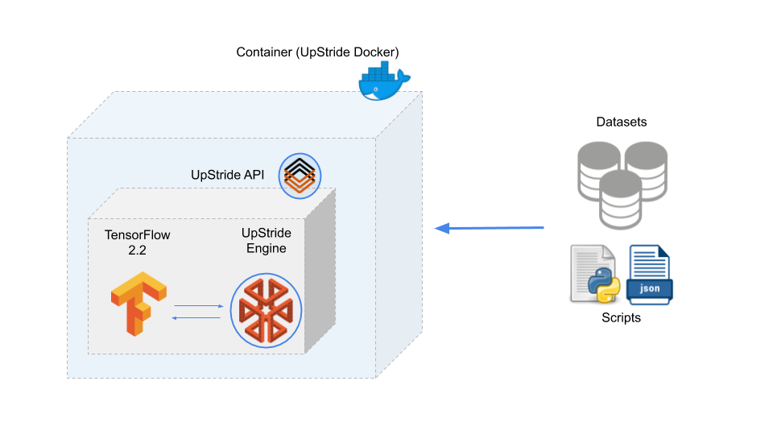

# Introduction

Welcome to the UpStride Documentation!

UpStride improves the overall performance of neural networks by leveraging the properties of our proprietary datatype, Hycor.

It offers a computational engine (that packages the Hycor) and a Python API to be used with TensorFlow/Keras.

Among the benefits of using UpStride instead of pure TensorFlow:

- Reduce in up to 10x the amount of data necessary to train a neural net in computer-vision tasks while keeping the same accuracy.
- Boost the accuracy performance of your neural network
- Generate more compact models (less floating-point parameters). This eases the deployment of neural nets in low-power and mobile devices, reducing energy consumption.


Check out the video below for an overview of UpStride.

[](https://youtu.be/QBTp95evukE)


## How it works

UpStride integrates seamlessly with TensorFlow 2.2 (other frameworks, e.g. PyTorch, will be available in the future). It is assumed the user is experienced with development based on TensorFlow/Keras.

We offer two ways to use UpStride, either on the cloud or on premises:

1. UpStride Cloud:
  - Make training and inference requests using the UpStride REST API
  - Expose trained models to the internet by creating unique endpoints
  - Command-line interface (CLI) and simple web interface
2. UpStride Enterprise:
  - Docker is shipped to the client
  - It can be installed in a local server/machine (requires the purchase of a license)
  - Access to full-blown functionalities of the UpStride Python API.

Here is how UpStride integrates within a training/inference AI pipeline:



The dashed box represents the UpStride Docker container. The user runs the docker, loads her datasets and scripts, and uses the UpStride API to build neural networks that leverage
the UpStride engine computational power.

# Using Upstride Engine

### Introduction

> This is a simple Upstride neural network:

```python
import tensorflow as tf
from upstride.type2.tf.keras import layers

inputs = tf.keras.layers.Input(shape=(224, 224, 3))
x = layers.TF2Upstride()(inputs)
x = layers.Conv2D(32, (3, 3))(x)
x = layers.Activation('relu')(x)
x = layers.Conv2D(64, (3, 3))(x)
x = layers.Activation('relu')(x)
x = layers.Flatten()(x)
x = layers.Dense(100)(x)
x = layers.Upstride2TF()(x)

model = tf.keras.Model(inputs=[inputs], outputs=[x])
```

> 


UpStride's engine is divided in three main modules type1, type2 and type3.

Each module has his special capabilities and should be used to enhance a Deep Neural Networks in their specific cases.

Every module encapsulate a API similar to Keras.

To use it, start by importing the layers package from the upstride type you want to use. 

Then the neural network can be define using keras API. Start by defining a Input, convert it to Upstride by calling `layers.TF2Upstride` and build
the neural network the same way you do with Keras. At the end of the neural network call `layers.Upstride2TF` to convert back upstride tensor to 
TensorFlow tensor.

For training and inference, all TensorFlow tools can be used (distribute strategies, mixed-precision training...)

# Hycor API 1.2

The Hycor is UpStride's unique and proprietary datatype. The following documentation describes how one can use and benefit from the Hycor-based layers to build neural networks.

This is the documentation of the Hycor API 1.2.

Only Python 3.6 or later is supported.

## Module: upstride

The main module, where the UpStride custom layers are implemented.

UpStride's engine is divided in three main modules `type1`, `type2` and `type3`.

Each module has his special capabilities and should be used to enhance a Deep Neural Networks in their specific cases.

Every module has the same the same type of layers and functions availables.

## Submodule: upstride.type1

> to import type 1

```python
from upstride.type1.tf.keras import layers
```
>

This submodule should be used to deal with 2D data like points, lines, polygons or grayscale images. The type1 submodule layers are accesible by:


## Submodule: upstride.type2

> to import type 2

```python
from upstride.type2.tf.keras import layers
```
>

This submodule should be used to deal with simple 3D data like 3D point cloud, 3D lines, polyhedrons or colored images. The type2 submodule layers are accesible by:

import upstride.type2.tf.keras.layers as uplayers

## Submodule: upstride.type3

> to import type 3

```python
from upstride.type3.tf.keras import layers
```
>


This submodule should be used to deal with more complex 3D data like 3D point cloud, 3D lines, polyhedrons or colored images. The type3 submodule layers are accesible by:

# Compromise between model size and accuracy performance (the 'factor' parameter)

> This is a simple Upstride neural network with factor parameter:

```python
import tensorflow as tf
from upstride.type2.tf.keras import layers

factor = 4

inputs = tf.keras.layers.Input(shape=(224, 224, 3))
x = layers.TF2Upstride()(inputs)
x = layers.Conv2D(32 // factor, (3, 3))(x)
x = layers.Activation('relu')(x)
x = layers.Conv2D(64 // factor, (3, 3))(x)
x = layers.Activation('relu')(x)
x = layers.Flatten()(x)
x = layers.Dense(100 // factor)(x)
x = layers.Upstride2TF()(x)

model = tf.keras.Model(inputs=[inputs], outputs=[x])
```

> 


The simplest way to adapt your own code is described above: you only need to call the UpStride layers instead of regular TensorFlow. It allows the user to readily benefit from the superior learning capabilities of our Engine. This is the "vanilla" way of using UpStride.

However, due to the way the underlying UpStride mathematics is implemented, the vanilla approach results in a model that contains more free parameters than its pure TensorFlow counterpart. That's the way to go if you are after accuracy performance at all cost and can afford training bigger models.

However, there are use cases that ask for an increase in accuracy performance but are also constrained by the final size of the model. This is the case for any application that deploys intelligence on the edge, e.g., smartphones, IoTs -- every extra megabyte, or even kilobyte, may prevent the model to fit in the limited memory (RAM and storage) of edge devices.

The factor parameter L enables the user to make a compromise between overall accuracy performance and total number of free parameters of a model.

Let's revisit the code snippet of the examples above:

# Type 2 specificities

When working in type 2, some options are available to improve the neural-network performance.

## Tf2Upstride

Several strategies are available to convert TensorFlow tensors to Upstride tensors.

> Default

```python
x = layers.TF2Upstride()(inputs)
```
>

- `default`: our data structure is initialized with 0.


> joint

```python
x = layers.TF2Upstride(strategy='joint')(inputs)
```
>

- `joint`: the color information is used to create our data structure


>
grayscale

```python
x = layers.TF2Upstride(strategy='grayscale')(inputs)
```
>

- `grayscale`: both the rgb and grayscale information are used to create our data structure


> learned

```python
x = layers.TF2Upstride(strategy='learned')(inputs)
```
>

- `learned`: a small neural network (2 convolutions with 3x3 kernel and 3 channels) is learning a mapping to project the information to our data structure. This method is a bit more expensive but may give better results


## Upstride2TF


> To concatenate the Hycor into a single vector

```python
x = layers.Upstride2TF(strategy = "concat")(x)
```
>

Two strategies are possible:

- default
- concat

`default` mode outputs a tensor that keeps only the first slot of the Hycor, whereas `concat` generates a vector by merging all the slots of the Hycor together.


